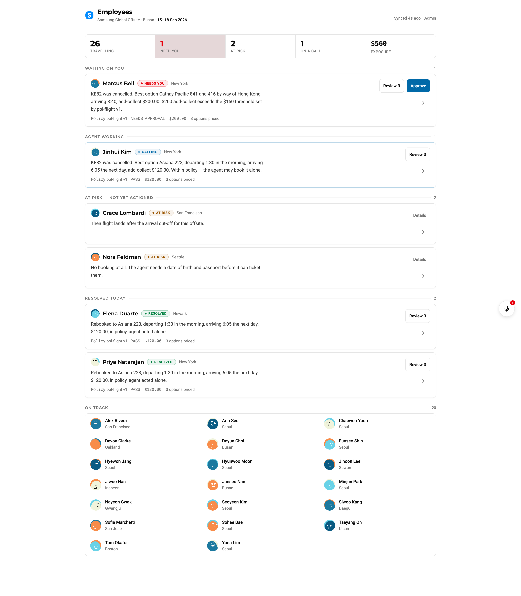
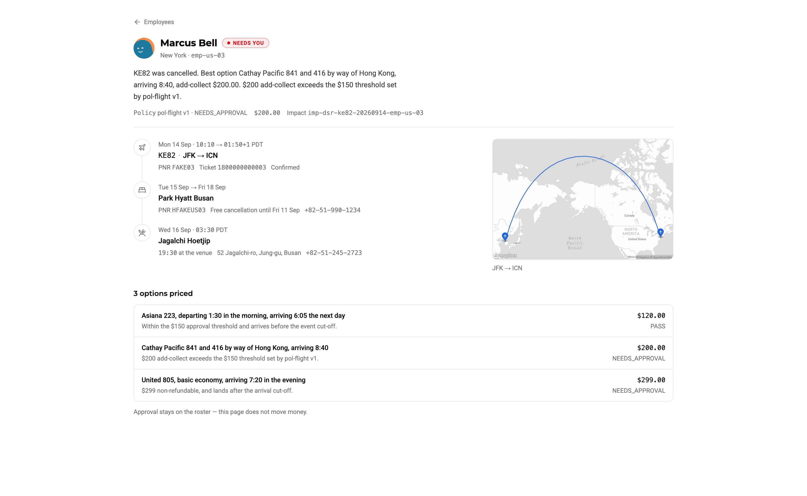
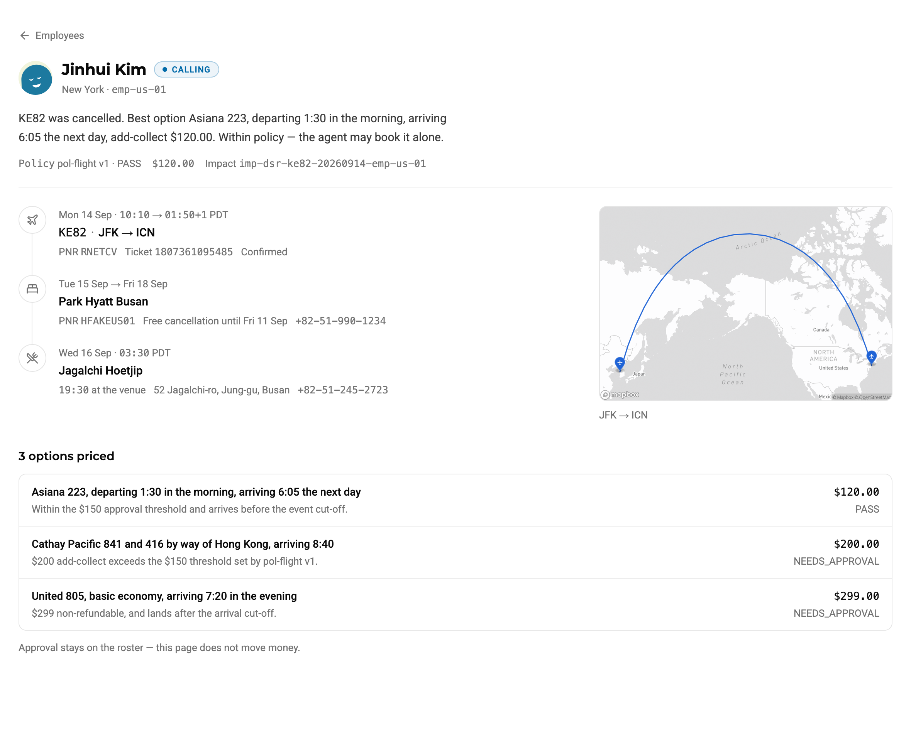
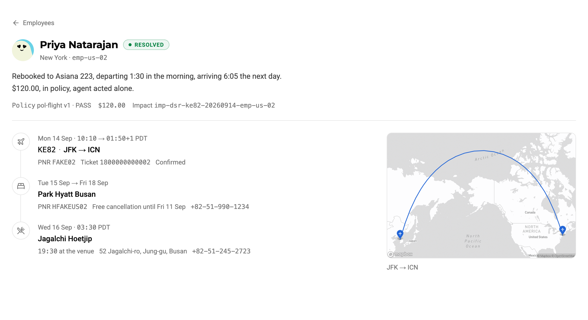

# Chingu

B2B triage software for company offsites. When a flight is cancelled or a traveller is at risk, Chingu finds the fix, checks it against policy, and lets an AI voice agent act on it, so people-ops only step in when a decision is really needed.



## How it works

```
 flight cancelled / traveller at risk
                 │
                 ▼
   Triage ── who is affected? ──► roster (needs you / calling / at risk / resolved)
                 │
                 ▼
   Sabre ─── price rebooking options
                 │
                 ▼
   Policy check (e.g. add-collect <= $150)
        │                        │
     within policy          over threshold
        │                        │
        ▼                        ▼
   Agent acts alone       Coordinator approves
        └───────────┬────────────┘
                    ▼
   Voice agent (VocalBridge) calls the traveller / hotel / venue
                    ▼
                Resolved
```

| Needs approval | Agent calling | Resolved |
|---|---|---|
|  |  |  |

## Requirements

| Need | Why | Required for |
|---|---|---|
| [Bun](https://bun.sh) and Node 20+ | Package manager and test runner | Everything |
| [Cloudflare Workers](https://developers.cloudflare.com/workers/) (via `wrangler`, installed with the repo) | Runs the API: D1, Durable Objects and Queues. Local dev needs no account; deploying does | Everything |
| **Mapbox API key** (public `pk.` token) | Trip maps on the employee page | Maps |
| VocalBridge API key and agent ID | Outbound voice calls | Live calls only |
| Sabre CERT credentials | Live flight and hotel search and booking | Live booking only |

The seeded demo (26 employees, Samsung Global Offsite, Busan, 15–18 Sep 2026) runs locally with no Sabre calls and no phone calls. Restrict your Mapbox token by URL in the Mapbox dashboard, because it ships in the client bundle.

## Run it locally

```bash
# 1. Install
(cd worker && bun install)
(cd frontend && bun install)

# 2. Configure the worker (git-ignored)
cat > worker/.dev.vars <<'EOF'
VB_API_KEY=...            # VocalBridge key
VB_AGENT_ID=...           # VocalBridge agent
DIAL_ALLOWLIST=+1...      # only these numbers may ever be dialled (deny by default)
ENABLE_DEV_ROUTES=true    # enables /api/dev/* (disrupt, reset). Local only.
EOF

# 3. Configure the frontend
echo 'MAPBOX_API_KEY=pk.your_token' > frontend/.env

# 4. Create and seed the local database
cd worker
bunx wrangler d1 execute chingu --local --file=./schema.sql
bunx wrangler d1 execute chingu --local --file=./seed.sql

# 5. Start the API (http://localhost:8787)
bun run dev

# 6. In a second terminal, start the UI (http://localhost:5173)
cd frontend && bun run dev
```

Open http://localhost:5173. Vite proxies `/api/*` to the worker.

To try the UI without the worker, run `VITE_USE_FIXTURES=1 bun run dev` in `frontend/`.

## Trigger a disruption

With `ENABLE_DEV_ROUTES=true`:

```bash
curl -X POST localhost:8787/api/dev/disrupt   # cancel KE82, triage the roster
curl -X POST localhost:8787/api/dev/reset     # back to the seed state
```

## Tests

```bash
(cd worker && bun test)
(cd backend/sabre && bun test)
(cd backend/workers/tools && bun test)
```

## Layout

```
frontend/             React + Vite + Tailwind dashboard
worker/               Dispatch API: roster, policy, queue, call state (Cloudflare Worker)
backend/sabre/        Sabre adapter (pure TypeScript)
backend/workers/tools Tool endpoints the voice agents call, one bearer token per slot
docs/                 Data model, plus Sabre and VocalBridge findings
```

Everything runs against Sabre **CERT**. Nothing is ever booked or charged in production.
